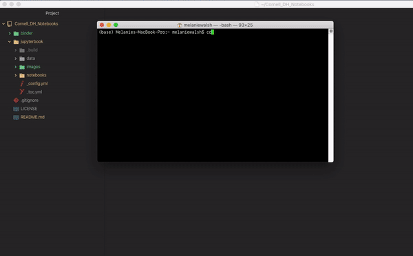

# Cornell Digital Humanities Notebook Series

This is the start of our Jupyter Book project for the Cornell DH Notebooks Series.

[](https://melaniewalsh.github.io/Cornell-DH-Notebooks/)

The Python package [`jupyter-book`](https://jupyterbook.org/start/build.html) processes the Jupyter notebook files from this repository and outputs them as the publication-quality HTML files that generate our [corresponding website](https://melaniewalsh.github.io/Cornell-DH-Notebooks/).

The HTML files are currently hidden in this branch of the GitHub repository, but you can find them in the [gh-pages branch](https://github.com/melaniewalsh/Cornell-DH-Notebooks/tree/gh-pages).

## How to add to this book

If you'd like to add a notebook to our Jupyter Book and publish it on our website, you should:

- Clone this repository 
- Add your notebook to the correct issue directory, e.g., `jupyterbook/notebooks/Issue-1`
- Run `jupyter-book build jupyterbook` or `jb build jupyterbook`
- Push the HTML files to the `gh-pages` branch of this repository:

  A fully-rendered HTML version of the book will be built in `jupyterbook/_build/html/`. You can push these HTML files to our website by pushing them to the `gh-pages` branch of the repository.

  One easy way to push to the `gh-pages` branch is to [install `gh-import`](https://jupyterbook.org/publish/gh-pages.html#push-your-book-to-a-branch-hosted-by-github-pages) and run `ghp-import -n -p -f jupyterbook/_build/html`



## What's in this repository?

Below I will briefly explain the structure of this repository and some important Jupyter Book features.

-  `/jupyterbook` contains all the materials that generate our Jupyter Book
- `/binder` contains materials that set up our virtual [Binder](https://mybinder.org/) environment for running Jupyter notebooks in the cloud 

### Configuration file

The configuration file `/jupyterbook/_config.yml` is where we establish key features of the book, such as its title and logo as well as whether we want to be able to open our Jupyter notebook files in the cloud.
 
### Table of Contents file

The table of contents file `/jupyterbook/_toc.yml` establishes the table of contents structure on the left-hand side of the web page. To include a markdown or Jupyter notebook file in the table of contents, you include the flag `- file:` followed by the file path *without* the file extension, as shown below: 
```
- file: notebooks/intro

- part: How To
  chapters:
  - file: notebooks/How-To-Interact-With-This-Series
    title: Interact With This Series
    
- part: Issues
  chapters:
  - file: notebooks/Issue-1/intro
    title: Issue 1
    sections:
      - file: notebooks/Issue-1/Mapping-Kate-Chopin 
```

If you want the title in the table of contents to be different from the title in the notebook, you can also specify a different `title` below the `- file:` flag. Finally, you can include section headers within the table of contents by using the `- part` flag or designate nested chapters by including `chapters:`.

### Notebooks

The Jupyter notebook files can be found in `jupyterbook/notebooks`

### Data

Data can be can be found in `jupyterbook/data`

### Images

Images can be can be found in `jupyterbook/images`

## Learn More About Jupyter Book

This project is created using the excellent open source [Jupyter Book project](https://jupyterbook.org/). You can learn more about Jupyter Book by exploring the documentation: https://jupyterbook.org/intro.html
